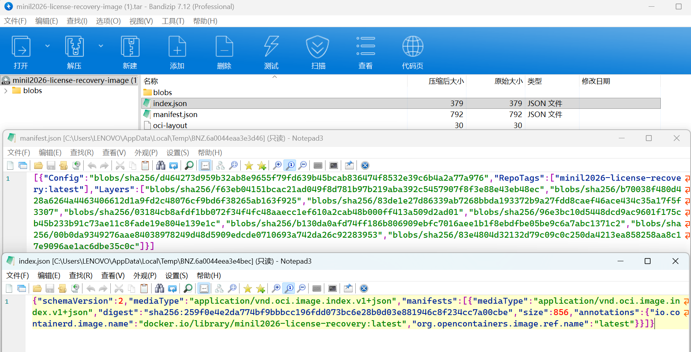
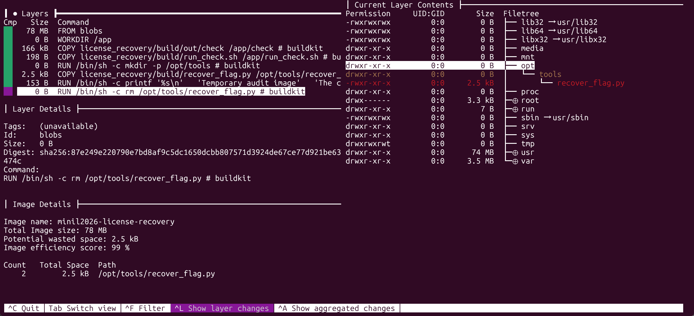

# License Recovery

省流：

1. 附件本质上是一个 OCI / Docker 镜像归档
2. 最终镜像里只剩下一个 `check` 程序，但恢复 flag 的脚本在旧 layer 里出现过，后来被删掉了
3. 先从历史 layer 中把 `recover_flag.py` 捞出来
4. 再分析 `check`，发现它校验的其实是一个 32 位 token 对应的“手势 PNG”
5. 读图得到 `LICENSE-XXXXXXXX`，喂给恢复脚本，就能解出 flag

## 1. 检查 Docker image 归档

题目发的是一个 `tar` 文件，先打开看看



可以看到里面有这些很熟悉的文件：

- `manifest.json`
- `index.json`
- `oci-layout`
- `blobs/sha256/...`

到这里基本可以确定，这不是普通资料包，而是一个 OCI / Docker 镜像归档。我们可以先运行看看：

```bash
$ docker load -i minil2026-license-recovery-image.tar
Loaded image: minil2026-license-recovery:latest

$ docker run -it minil2026-license-recovery
Enter license key: help
Invalid license.
Try again.
# 然后可以按 Ctrl+P Ctrl+Q 退出容器或者发 EOF 结束程序（Ctrl+Z 然后回车/Ctrl+C）
```

可以看到这个镜像存在一个校验 license key 的程序，但我们输入 `help` 之后它只是说“无效”，并没有给出任何提示。

直接看镜像不太好看，我们可以使用一个叫 [dive](https://github.com/wagoodman/dive) 的工具来查看，可以看到镜像的构建历史和每一层的文件系统变化：



这个工具查到的镜像的构建历史：

```Dockerfile
FROM blobs
WORKDIR /app
COPY build/out/check /app/check
COPY build/run_check.sh /app/run_check.sh
RUN mkdir -p /opt/tools
COPY build/recover_flag.py /opt/tools/recover_flag.py

RUN printf '%s\n' \
  'Temporary audit image' \
  'The checker binary survived.' \
  'A recovery helper was removed in a later layer.' \
  'Layer history matters more than the final filesystem.' \
  > /README.txt

RUN rm /opt/tools/recover_flag.py
```

镜像构建历史的 8 条命令分别对应我们在 `manifest.json` 里看到的 8 个 layer。根据 printf 的提示，我们可以知道：“恢复脚本在后面的层被移除了”，但是 Docker 在执行 `rm /opt/tools/recover_flag.py` 的时候，并不会真的把之前层里 `/opt/tools/recover_flag.py` 的内容从镜像里删除掉，而是通过覆盖的方式让它在最终镜像里不可见了。所以我们需要从历史 layer 里把 `recover_flag.py` 捞出来。

```jsonc
[
    {
        "Config": "blobs/sha256/d464273d959b32ab8e9655f79fd639b45bcab836474f8532e39c6b4a2a77a976",
        "RepoTags": [
            "minil2026-license-recovery:latest"
        ],
        "Layers": [
            // FROM blobs
            "blobs/sha256/f63eb04151bcac21ad049f8d781b97b219aba392c5457907f8f3e88e43eb48ec", 
            // WORKDIR /app
            "blobs/sha256/b70038f480d428a6264a4463406612d1a9fd2c48076cf9bd6f38265ab163f925",
            // COPY build/out/check /app/check
            "blobs/sha256/83de1e27d86339ab7268bbda193372b9a27fdd8caef46ace434c35a17f5f3307",
            // COPY build/run_check.sh /app/run_check.sh
            "blobs/sha256/03184cb8afdf1bb072f34f4fc48aaecc1ef610a2cab48b000ff413a509d2ad01",
            // RUN mkdir -p /opt/tools
            "blobs/sha256/96e3bc10d5448dcd9ac9601f175cb45b233b91c73ae11c8fade19e804e139e1c",
            // COPY build/recover_flag.py /opt/tools/recover_flag.py
            "blobs/sha256/b130da0afd74ff186b806909ebfc7016aee1b1f8ebdfbe05be9c6a7abc1371c2",
            // RUN printf "..." > /README.txt
            "blobs/sha256/00b0da9349276aae84038978249d48d5909edcde0710693a742da26c92283953",
            // RUN rm /opt/tools/recover_flag.py
            "blobs/sha256/83e4804d32132d79c09c0c250da4213ea858258aa8c17e9096ae1ac6dbe35c0c"
        ]
    }
]
```

所以我们解压 `blobs/sha256` 下的 `83de1e27`、`03184cb8`、`b130da0a` 这三个 layer 来提取出 `check`，`run_check.sh` 和 `recover_flag.py`，当然除了 `b130da0a` 外，其他两个 layer 中的文件可以通过 `docker exec -it /bin/bash <container_id>` 进入容器后直接看到，而不一定要从 image 中提取。

```bash
$ tar -xvf 03184cb8
app/
app/run_check.sh
$ tar -xvf 83de1e27
app/
app/check
$ tar -xvf b130da0a
opt/
opt/tools/
opt/tools/recover_flag.py
```

## 2. 提取文件与白盒审计

run_check.sh 的内容：

```bash
#!/usr/bin/env bash
set -u

while true; do
  printf "Enter license key: "
  if ! IFS= read -r license; then
    exit 1
  fi
  if /app/check "$license"; then
    exit 0
  fi
  echo "Try again."
don
```

发现它只是一个简单的循环，调用 `check` 来校验输入的 license key，如果校验通过就退出，否则提示“Try again.”，继续让用户输入。

在来查一下 check：

```bash
$ file app/check
app/check: ELF 64-bit LSB pie executable, x86-64, version 1 (SYSV), dynamically linked, interpreter /lib64/ld-linux-x86-64.so.2, BuildID[sha1]=6f089ba4ba643200c501a1453ebf35bd77258993, for GNU/Linux 3.2.0, not stripped
```

recover_flag.py 的内容：

```python
#!/usr/bin/env python3
import hashlib
import sys

CIPHERTEXT = bytes([
    0x63, 0xa2, 0xee, 0x83, 0xbd, 0x85, 0x6e, 0xae, 0x9a, 0xaf, 0xa7, 0x60,
    0xfb, 0xd2, 0x91, 0x05, 0xb2, 0xdd, 0x6e, 0x7e, 0x4d, 0xda, 0x90, 0xa2,
    0x13, 0x6d, 0xc0, 0x86, 0xb7, 0xd1, 0x19, 0x79, 0x98, 0xe2, 0x32, 0x3d,
    0xb0, 0xdf, 0xba, 0xa6, 0xe9, 0xf3, 0x4c
])
SALT = bytes([
    0x96, 0xa6, 0x1a, 0x4d, 0xd9, 0x3a, 0x77, 0x87, 0x0c, 0x62, 0x0c, 0x2f,
    0xff, 0x67, 0x3f, 0x4e
])
PLAINTEXT_DIGEST = bytes([
    0x08, 0xc5, 0x23, 0x04, 0x7f, 0xe7, 0x28, 0x4b, 0x99, 0xbb, 0x2c, 0x54,
    0x5e, 0x8a, 0x64, 0x54, 0x15, 0x44, 0xdd, 0x37, 0x6f, 0x25, 0xbe, 0xb8,
    0x7b, 0x3e, 0x18, 0xd7, 0xda, 0xc1, 0x21, 0x1e
])

def parse_key(text: str) -> int:
    value = text.strip()
    if value.startswith("LICENSE-"):
        value = value[len("LICENSE-"):]
    if value.lower().startswith("0x"):
        value = value[2:]
    if len(value) != 8:
        raise ValueError("need exactly 8 hex digits")
    return int(value, 16)

def derive_keystream(key: int, salt: bytes, length: int) -> bytes:
    key_bytes = key.to_bytes(4, "big")
    stream = bytearray()
    counter = 0
    while len(stream) < length:
        block = hashlib.sha256(key_bytes + salt + counter.to_bytes(4, "big")).digest()
        stream.extend(block)
        counter += 1
    return bytes(stream[:length])

def decrypt(ciphertext: bytes, key: int, salt: bytes) -> bytes:
    keystream = derive_keystream(key, salt, len(ciphertext))
    return bytes(byte ^ keystream[index] for index, byte in enumerate(ciphertext))

def main() -> int:
    if len(sys.argv) > 1:
        key_text = sys.argv[1]
    else:
        key_text = input("Enter 32-bit key or LICENSE-XXXXXXXX: ")

    try:
        key = parse_key(key_text)
    except ValueError as exc:
        print(f"invalid key: {exc}", file=sys.stderr)
        return 1

    plaintext = decrypt(CIPHERTEXT, key, SALT)
    if hashlib.sha256(plaintext).digest() != PLAINTEXT_DIGEST:
        print("Invalid key.", file=sys.stderr)
        return 1

    try:
        decoded = plaintext.decode("utf-8")
    except UnicodeDecodeError:
        print("Invalid key.", file=sys.stderr)
        return 1

    if not decoded.startswith("miniL{") or not decoded.endswith("}"):
        print("Invalid key.", file=sys.stderr)
        return 1

    sys.stdout.write(decoded)
    sys.stdout.write("\n")
    return 0

if __name__ == "__main__":
    raise SystemExit(main())
```

分析 `recover_flag.py`，我们会发现它的核心逻辑其实并不复杂：
- 输入一个 32 位的 key，或者 `LICENSE-XXXXXXXX` 这种形式
- 用这个 key 生成 keystream
- 对内置密文做解密
- 如果结果校验通过，就输出 flag

所以到这里可以确定：只要找到正确的 32 位 token，就能把 flag 解出来。

## 3. 分析 `check`

恢复脚本解决了“知道 key 以后怎么出 flag”的问题，但还没有解决“key 从哪来”。

继续看镜像里还留下来的 `check`。对于 Misc 题，我们一般会先用 `strings` 看看它输出什么：

```bash
$ strings -n 10 app/check

Enter license key:
Input error.
Invalid license.
License accepted.
The old recovery helper used the same 32-bit token.
https://github.com/thebabush/llvm-jutsu
# 输出很多其他无关的字符串，此处省略
```

查看一下 [llvm-jutsu](https://github.com/thebabush/llvm-jutsu) 的仓库，我们会发现它是一个“LLVM 混淆工具”，可以将程序中的整数常量替换为可视化的“手势 PNG”。所以我们可以大胆猜测，`check` 里可能是把输入的 key 转成了一个“手势 PNG”，然后和某个内置的 PNG 做比较。

我们可以使用 `binwalk` 看看 `check` 里有没有 PNG：

```bash
$ binwalk app/check

DECIMAL       HEXADECIMAL     DESCRIPTION
--------------------------------------------------------------------------------
0             0x0             ELF, 64-bit LSB shared object, AMD x86-64, version 1 (SYSV)
73655         0x11FB7         bix header, header size: 64 bytes, header CRC: 0x85C00F, created: 2040-08-31 21:11:28, image size: 4765697 bytes, Data Address: 0x1, Entry Point: 0x45, data CRC: 0x31DB48C7, compression type: bzip2, image name: ""
90368         0x16100         PNG image, 256 x 256, 8-bit/color RGBA, non-interlaced
128960        0x1F7C0         CRC32 polynomial table, little endian
```

然后用 `dd` 把 PNG 切出来：

```bash
$ dd if=app/check of=image.png bs=1 skip=90368
# 这个会将 check 里从 90368 字节开始一直切到文件末尾的内容，但是不影响，多数图片查看器会自动忽略尾部多余内容
```


从 llvm-jutsu 的仓库我们知道：

```markdown
A 32-bit integer becomes four hands, each representing one byte. Thumb = bit 7, fingers = bits 6 through 0. Extended = 1, bent = 0.

0xDEADBEEF
┌─────────┬─────────┐
│ byte 0  │ byte 1  │
│  0xEF   │  0xBE   │
├─────────┼─────────┤
│ byte 2  │ byte 3  │
│  0xAD   │  0xDE   │
└─────────┴─────────┘
```

所以上图从 `byte3` 到 `byte0` 分别是：

- `01101111` -> 0x6F
- `01001111` -> 0x4F
- `11101010` -> 0xEA
- `11110101` -> 0xF5

所以这个 PNG 对应的 32 位 token 是 `0x6F4FEAF5`，也就是 `LICENSE-6F4FEAF5`。

```bash
$ app/check
Enter license key: LICENSE-6F4FEAF5
License accepted.
The old recovery helper used the same 32-bit token.

$ python ./opt/tools/recover_flag.py
Enter 32-bit key or LICENSE-XXXXXXXX: LICENSE-6F4FEAF5
miniL{535a28d2-bcfa-4497-8519-f80443a056b4}
```

## 其他解法

当然，除了上面这种“白盒审计+读图”的解法以外，这道题还有其他的解法：
- 本题的关键在于 i32 形式的 key，但 i32 的搜索空间只有 2^32，完全可以通过暴力爆破来解决，但爆破整个空间需要较长时间（数个小时）。
- 所以直接对 `check` 做白盒逆向+动态调试，在程序校验的时候下断点进行爆破，结合 `miniL{` 的已知前缀可以大幅缩小搜索空间，多线程爆破的情况下可将爆破时间缩短至几分钟内。