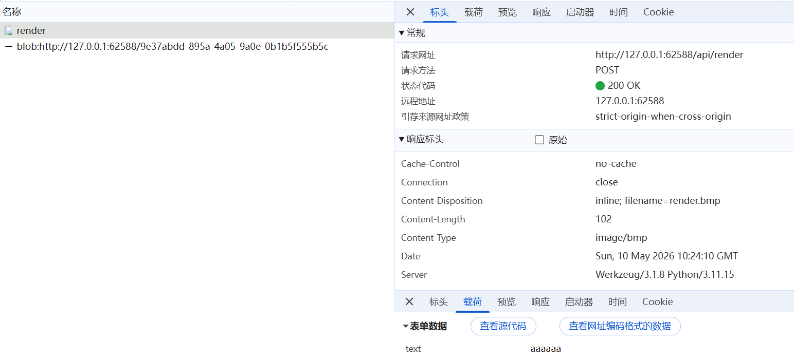
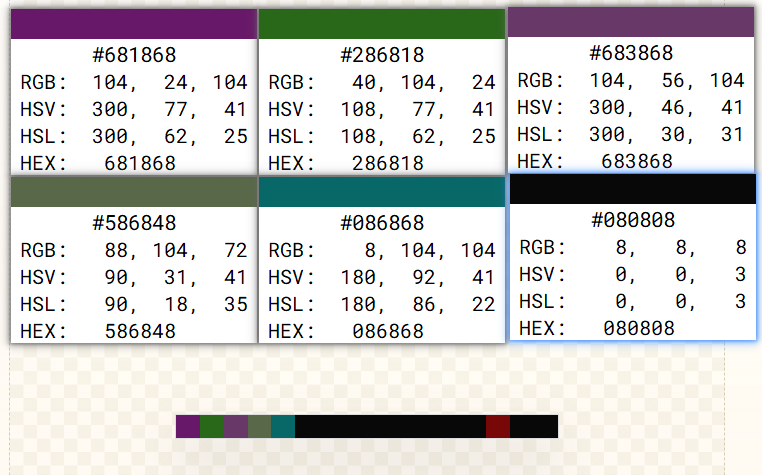

# Only 4-Bit Depth?

省流：

1. 题目给了一个“文本 -> BMP”的 blackbox 和一张目标 `flag.bmp`
2. 通过少量探测可以发现，颜色分量并不是任意值，而是只落在固定档位上
3. 每个颜色通道实际上承载的是一个 4-bit nibble
4. 再结合 BMP 的 `BGR` 顺序和自底向上的存储方式，就能把整张图还原回字节流
5. 字节流尾部还带了一个 4 字节长度字段，截断后就是原始文本，也就是 flag

## 1. 先和 blackbox 交互

这题第一眼看上去就是隐写/编码类题目。题目同时还给了一个“文本转 BMP”的 blackbox，对 `aaaaaa` 作为输入抓包得到如下结果：



最自然的做法就是先拿最简单的输入去试。比如：

```bash
curl -X POST -d 'text=A' http://127.0.0.1:62588/api/render -o A.bmp
curl -X POST -d 'text=AB' http://127.0.0.1:62588/api/render -o AB.bmp
curl -X POST -d 'text=ABC' http://127.0.0.1:62588/api/render -o ABC.bmp
curl -X POST -d 'text=Hello' http://127.0.0.1:62588/api/render -o hello.bmp
```

接下来需要观察这些图的像素值。这里用什么工具都可以：

- 自己写个很短的脚本
- 用图片软件看像素
- 或者导出原始像素数据再读

这一步没有什么技巧，核心就是“拿样本看规律”。

## 2. 发现颜色只取固定档位

输入为 `aabcdef` 的输出：


一旦开始看像素，会很容易注意到一个非常不自然的现象：

- 颜色分量不是连续变化的
- 它们只会出现在 `8, 24, 40, 56, ...` 这些数上
- 相邻两个值固定相差 `16`

这意味着颜色分量其实不是在表达 0~255 的完整范围，而是在表达一组很小的离散状态。

于是很自然会猜到：

```text
color = 8 + 16 * x
```

也就是说，一个颜色分量其实只承载了一个 `0...15` 的值，也就是一个 nibble（
4 bit）的数据。

## 3. 用单字符样例确认“每个字节拆成两个 nibble”

有了上一步的猜测，接下来拿单字符去验证最合适。  
例如 `a` 的 ASCII 是 `0x61`，如果它真的被拆成两个 nibble，那就应该是：

- 高 4 位：`6` -> 映射回颜色档位就是 `6 -> 104`
- 低 4 位：`1` -> 映射回颜色档位就是 `1 -> 24`

如果我们继续对 `b`、`c` 等字符做同样的观察，会发现它们都能对上这个规律。

到这里就可以下结论了：

1. 文本会先变成字节流
2. 每个字节会被拆成两个 4-bit nibble
3. 每个 nibble 再映射成一个颜色分量

这样，我们就做到了 3 个字节 <-> 6 个颜色分量 <-> 2 个像素的转换。

## 4. 解决两个顺序问题

知道了“一个颜色分量对应一个 nibble”还不够，因为还差两个顺序问题没有搞清楚：

1. 一个像素里的三个通道，谁先谁后
2. 整张 BMP 的各行是按什么顺序存的

这里有两个关于 [BMP](https://en.wikipedia.org/wiki/BMP_file_format) 的很重要的背景知识：

- 24-bit BMP 的每个像素在文件里通常按 `BGR` 存储
- BMP 默认是自底向上存各行，也就是说文件里的第一行像素不一定是图像“最上面那行”

因此如果我们直接按“看到的 RGB 顺序”和“从上往下读图”的直觉去解，很容易最后结果差一点但就是不对。

## 5. 尾部长度字段

到这里我们已经能按照上述规则解码出 FLAG 了，但是细想我们会发现问题：这个编码规则不能确定解出来的字节流里，哪里是正文哪里是后续的空白填充。

而我们同时能注意到图片从左到右、从下到上的最后几个像素的各分量并非全取 8，而是有一些 24、40 这样的档位，这就是尾部的长度字段，按小端序存储，转换后占 4 个字节。

所以正确的恢复流程应该是：

1. 把整张图解成原始字节流
2. 读最后 4 字节，按小端解释为长度
3. 取前 `length` 个字节
4. 再解码

## 6. 开始解真正的 `flag.bmp`

题目页面会提供最终目标文件，只需要自己写一个很短的小工具去还原即可。  

这一步不需要写很长代码，核心操作只有这些：

1. 读取 BMP 像素数据
2. 逐行按实际存储顺序取像素
3. 对每个像素按 `B -> G -> R` 取三个通道
4. 用 `(color - 8) / 16` 还原出 nibble
5. 每两个 nibble 拼回一个字节
6. 用末尾的 4 字节长度字段截断正文

具体实现此处略去，请选手自行实现。
